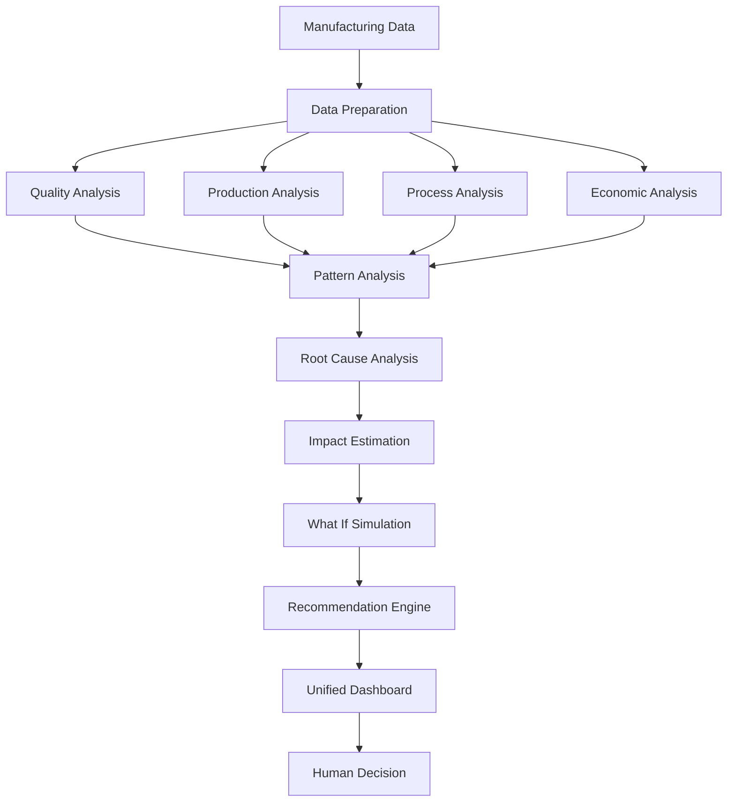

# Neurax-


## Problem
High-throughput manufacturing environments involve multiple interacting factors such as product quality, production capacity, process conditions, and economics. Defects may be difficult to detect, while production bottlenecks can arise from cycle-time imbalance, work-in-process buildup, downtime, changeovers, low utilization, scrap, and rework.

The challenge becomes more complex when manufacturing lines contain:
- Multiple product variants
- Changing inspection conditions
- Recurring defect families
- Batch-to-batch process drift
- Different station capacities
- Changing operating conditions
---

## Solution
We propose a unified, software-only AI decision-support system that continuously analyzes inspection, production, and economic data to answer:

### Key Questions Addressed
* **What is wrong?** Identify whether a product is acceptable or defective and determine the defect category.
* **Where is the defect?** Localize the defect using bounding boxes, masks, or heatmaps wherever the available data supports localization.
* **How confident is the system?** Provide calibrated confidence and identify uncertain or novel defect patterns instead of forcing an incorrect classification.
* **Why may the defect be happening?** Correlate defect patterns with process parameters, batches, stations, and operating conditions to identify likely contributing factors.
* **Where is production constrained?** Detect bottlenecks using cycle time, capacity, utilization, downtime, work-in-process, and related production-flow indicators.
* **What is the impact?** Estimate how defects and bottlenecks affect throughput, losses, production cost, and expected profitability.
* **What should be investigated?** Generate evidence-based process recommendations that remain simulated and advisory.
The system is designed specifically as an integrated industrial decision-support solution rather than an isolated image classifier or a standalone KPI dashboard.

##Architecture

## System Architecture

Our system follows a layered architecture that connects manufacturing data with AI analysis and decision support.



### Architecture Layers

**1. Data Layer**
Collects inspection, production, process, product, batch, and economic information.

**2. Data Preparation Layer**
Cleans, validates, transforms, and prepares the available data for analysis.

**3. AI and Analytics Layer**
Analyzes quality, production, process, and economic information to identify patterns and problems.

**4. Decision Intelligence Layer**
Performs root-cause investigation, impact estimation, and what-if simulation.

**5. Recommendation Layer**
Converts the analysis into evidence-based recommendations.

**6. Dashboard Layer**
Presents quality, production, root-cause, economic, and recommendation insights in one place.

---

## Approach

Our solution follows a simple idea:

**Detect → Understand → Connect → Simulate → Recommend**

### 1. Data Collection

We bring together the available manufacturing data:

* Inspection and quality data
* Production data
* Process conditions
* Product and batch information
* Economic data

### 2. Data Preparation

The collected data is cleaned and prepared by:

* Handling missing values
* Removing invalid or duplicate records
* Standardizing data
* Creating useful features
* Combining related datasets

### 3. Quality Analysis

The system analyzes inspection data to identify:

* Acceptable products
* Defective products
* Defect types and locations, when available
* Unusual or uncertain cases

The system avoids forcing uncertain cases into an existing category when the available evidence is insufficient.

### 4. Production and Bottleneck Analysis

We analyze:

* Cycle time
* Throughput
* Utilization
* Downtime
* WIP
* Changeover time
* Station capacity

This helps identify production stations that may be restricting the overall flow.

### 5. Root-Cause Analysis

The system connects quality problems with production and process conditions.

It looks for patterns across:

* Stations
* Batches
* Product variants
* Process conditions
* Operating conditions
* Time periods

The system identifies **possible contributing factors** rather than treating correlation as confirmed causation.

### 6. Impact Estimation

The system estimates how identified problems can affect:

* Production output
* Scrap
* Rework
* Downtime
* Operating cost
* Revenue
* Profit or margin

The calculation depends on the economic information available in the provided datasets.

### 7. What-If Simulation

Users can test possible improvement scenarios without affecting the real production system.

For example:

```text
Reduce Defect Rate
        |
        v
Less Scrap and Rework
        |
        v
More Good Output
        |
        v
Potential Cost Impact
```

Similar scenarios can be explored for cycle time, downtime, and other relevant production factors.

### 8. Recommendation Engine

The system combines the analysis and generates evidence-based recommendations.

Instead of only showing that a problem exists, it explains:

* Where the problem is
* What factors may be contributing
* How it affects production
* What improvement can be investigated

### 9. Unified Dashboard

The final dashboard brings the complete analysis together:

**Quality → Production → Root Cause → Impact → Recommendations**

---

## End-to-End Flow

```mermaid
flowchart TD
    A[Manufacturing Data] --> B[Data Preparation]

    B --> C[Quality Analysis]
    B --> D[Production Analysis]
    B --> E[Process Analysis]
    B --> F[Economic Analysis]

    C --> G[Pattern and Relationship Analysis]
    D --> G
    E --> G
    F --> G

    G --> H[Defect and Bottleneck Identification]
    H --> I[Root Cause Investigation]
    I --> J[Impact Estimation]
    J -
```****


                


